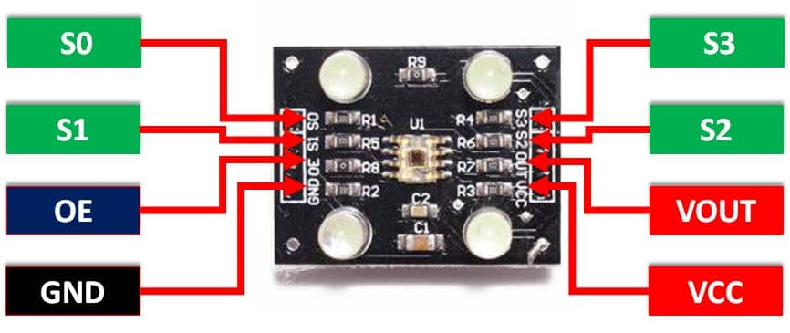

# Robotic-Arm
A Robotics arm used to automatically pick a pen of desired color and draw figures of definite shapes or draws freehand using joystick. Once drawing is over the robotic arm places the pen back at its initial position.

## Topics
* [Project Overview](https://docs.google.com/presentation/d/11_EpZ6iHl0rjGjqcXt7Djtx3-tjBNjVFvpS2eeTe8cQ/edit?usp=sharing)
* [Tools Used](#tools-used)
* [Connections](#connections)
* [Live Demonstration](#live-demonstration)

## Tools Used
- Arduino Uno, Joystick, Color Sensor, 3 * Servo Motor, Color pens (Red, Green & Blue default colors) and paper
- Plastic Robotic Body (can also be made out of cardboard) 
Purchase link: [Amazon](https://www.amazon.in/LINECRAFT-DESIGNS-Included-controller-Included/dp/B08R5S9WSX/ref=sr_1_8?crid=YNEWPKHV4T6U&keywords=robotics+arm&qid=1690636666&sprefix=robotics+a%2Caps%2C358&sr=8-8)

## Connections
### Color Sensor
Info how it detects color: [Link](https://lastminuteengineers.com/tcs230-tcs3200-color-sensor-arduino-tutorial/)

  

- S0: D4
- S1: D5
- S2: D6
- S3: D7
- OE: NA
- VOUT: D8
- VCC: 5V of Arduino
- GND: Ground of Arduino

### Joystick

  

- Switch: D7
- X Axis: A0
- Y Axis: A1
- 5V: 5V of Arduino
- Ground: Ground of Arduino

### Servo Motor
- Base Motor(X-Axis Movement of the arm): D11 pin
- Secondary Motor(for up down movement of end effector): D10 pin
- Gripper Motor: D12 pin

## Live Demonstration
Youtube: https://youtu.be/JoD6c_ftK9o
